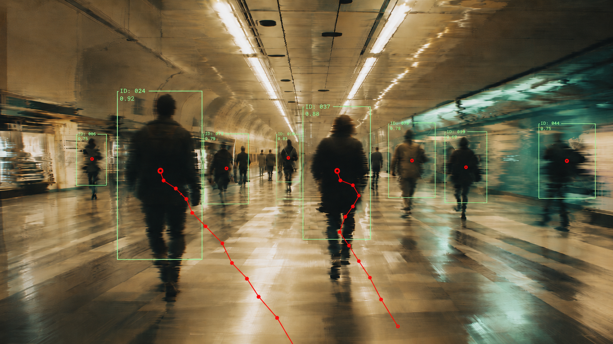

This React application compares client-side tracking using background subtraction and MediaPipe Tasks Vision. Both modes render bounding boxes, center points, IDs, and trajectories regions without uploading camera frames.

## Features
- リアルタイムなカメラ解析
- ブラウザのみで動作してインストール不要
- 映像を外部に送信せず端末内で完結
- ハードウェア（内臓・外部カメラ）に依存しない
- 以下のような解析の用途に利用可能
  - 滞在・活動量の可視化 
  - 動線・ヒートマップ生成
  - 

## Routes
- `/` — tracking method selection
- `/background-subtraction`
  - Background Subtraction Blob Tracker
  機械学習モデルを利用せず Background Subtraction（背景差分）を利用した動体検出の実装

- `/mediapipe-tasks-vision`
  - MediaPipe Tasks Vision Object Detection & Tracking
  特定のオブジェクトを対象に MediaPipe Tasks Vision の Object Detectorを利用した実装

## Background Subtraction
1. `getUserMedia()`でカメラ映像を取得
2. `requestVideoFrameCallback()`で映像フレームに同期
3. 設定の `Analysis resolution` で長辺320px/480pxを選択し、元映像の縦横比を保ち解析用Canvasへ縮小
4. Running Background Modelによる背景差分
5. 選択した解析解像度に連動したopeningによる孤立ノイズ除去（320pxでは3×3、480pxでは5×5）
6. 8近傍Connected ComponentsによるBlob抽出
7. 距離・IoU・速度予測によるTrackとの1対1関連付け
8. `object-fit: cover`を考慮してOverlay Canvasへ描画

## MediaPipe Tasks Vision
1. EfficientDet-Lite0 int8 v1とMediaPipe WASMを同一オリジンから読み込み
2. `requestVideoFrameCallback()`から既定10fps（5/10/15fpsから選択）で最新フレームを選択
3. 元映像の縦横比を維持し長辺640px以内へ縮小した`ImageBitmap`をmodule Workerへtransferし、`detectForVideo()`をMain Thread外で実行
4. `categoryAllowlist`で人物（初期値）・車・自転車を複数選択
5. MediaPipeのbboxを元映像の座標へ戻して共通の`Detection`へ変換し、カテゴリが一致するTrackだけを関連付け
6. カメラ・カテゴリ・映像寸法の変更時は世代番号を更新し、古い非同期結果を破棄
7. 共通の`BlobTracker`と`OverlayRenderer`でID・軌跡・グレースケール領域を描画

<!--### Processing and metrics
- Workerが受付可能なときだけFPSスケジューラを進め、画像取得・推論は同時に1件までで、フレームをキューに蓄積しない
- MediaPipeのTrack保持時間は、最初に関連付けできない検出結果を受け取ったフレーム時刻から800msです。結果待ちだけではTrackを失効させず、未検出が続いて期限を超えたIDは再利用しません。カメラ・映像寸法・設定の変更や非表示への移行では追跡をリセットします。
- `INFERENCE_LONG_EDGE`（`src/components/mediapipe-tasks-vision/config.ts`）で推論画像の長辺上限を調整できます。カメラ表示の解像度は変えません。小さい物体の精度と処理速度は対象端末で比較してください。
- 両方式でフィルター用Canvasは最大DPR 1、矩形・文字用は最大DPR 2です。上限は`OverlayRenderer.ts`の`FILTER_MAX_PIXEL_RATIO`と`OVERLAY_MAX_PIXEL_RATIO`で調整できます。
- 時間統計は最新120件の有効な結果について平均とp95（nearest-rank）を計算し、約500msごとに表示します。カメラ・設定・映像寸法・表示状態の切り替え時にリセットします。

`WORKER ROUND TRIP`には`INFERENCE TIME`が含まれるため、両者は加算しません。スキップ数はセッション内の累計です。受付状態を先に判定するため、設定上は間引くフレームでも処理中なら`BUSY SKIPS`へ計上されます。この数値だけでは過負荷を意味しません。-->

| Metric | Measurement |
| :--- | :--- |
| CAPTURE | `createImageBitmap()`による画像取得・縮小を含む時間 |
| WORKER ROUND TRIP | main threadから送信して結果を受信するまで（Worker待ち・推論・結果変換を含む） |
| INFERENCE TIME | Worker内の`detectForVideo()`呼び出し時間（内部前処理も含む） |
| TRACKING TIME | 結果をTrackへ関連付ける時間 |
| DRAW SUBMISSION | Canvasへの描画命令発行時間。GPU処理・合成・画面への表示完了は含まない |
| CAPTURE TO DRAW | 画像取得開始から描画命令発行完了まで |
| BUSY SKIPS | 画像取得・推論中のため見送ったカメラフレーム数 |
| RATE SKIPS | 受付可能だが設定FPSの間隔を満たさず見送ったフレーム数 |

## References
- [Media Capture and Streams](https://w3c.github.io/mediacapture-main/)
- [Video frame callbacks specification](https://wicg.github.io/video-rvfc/)
- [HTML Standard: video dimensions](https://html.spec.whatwg.org/multipage/media.html#dom-video-videowidth)
- [WebKit: `requestVideoFrameCallback()` support](https://webkit.org/blog/12445/new-webkit-features-in-safari-15-4/)
- [WebKit: `willReadFrequently` support](https://webkit.org/blog/15865/webkit-features-in-safari-18-0/#canvas)
- [Vite server options](https://v8.vite.dev/config/server-options)
- [MediaPipe Object Detector for Web](https://developers.google.com/edge/mediapipe/solutions/vision/object_detector/web_js)
- [MediaPipe Object Detector models](https://developers.google.com/edge/mediapipe/solutions/vision/object_detector#models)
- [MediaPipe official Web Worker sample](https://github.com/google-ai-edge/mediapipe-samples-web/blob/main/src/workers/object-detector.worker.ts)
- [React Router declarative routing](https://reactrouter.com/start/declarative/routing)
